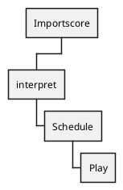

## Tim Hodgkinson and Andy Wilson

Imports an XML file structured as a score for the Infinity program.
For context see [Wikipedia](https://en.wikipedia.org/wiki/Infinity_(K-Space_album),  [FREQ](https://freq.org.uk/reviews/kspace-infinity/), and [Sunseastar](http://www.sunseastar.com/kspaceinfinity.html).

See `scores-template.xml` in the project root for the structure of a score file. View `scores.xml` to see what a real score looks like. 

#### Mail discussion between Tim Hodgkinson and Andy Wilson on the score format

**TH**: OK, so you have an audio file. You name it, or adjust its name, on the file icon and keep it in the RES file along with the score.xml document which is where you are encoding your work. You use the identical name to identify it within the SAMPLE identification in the code. You have to specify its exact length at this point. The easy way to do this is......?????.

**AW**: Open it in an audio editor and (depending on which editor you are using) open the 'file info' panel which will give you full details of the file including its length. If you have problems doing this, tell me what software you are using and I'll work out precise details.

**TH**: You can then specify all the operations listed in the example at the top of the sample code text using the VARIANTS system. If you don't want to specify any operations, the sample will be played as it is.

**AW**: Precisely. You've got it.

**TH**: This is then fitted into a CONCERT. CONCERTS contain SAMPLES and their VARIANTS, but can also contain CHOICES and other CONCERTS. Variants have to have a VARIANT ID. Choices have to be given CHOOSE IDs. Concerts get given CONCERT IDs. All components of CONCERTS are listed inside concerts as PARTS, whether they are samples or their variants, or choices, or other concerts. CONCERTS are where entry timings are specified. Everything down to here is a COMPONENT. The final stage is that you write SCORES that will then perform CONCERTS, and the scores together make up the PROGRAMME.

**AW**: Precisely. Conceptually there are only three kinds of entites - SAMPLES, CONCERTs and CHOOSEs. SAMPLES are 'primitive', but CONCERTS and CHOOSEs can contain and embed any other entity (a SAMPLE, a CHOOSE or a CONCERT). In the final SCORES section, each score is really just a container for one of the other entities (a CHOOSE, a CONCERT or - possible but unlikely - a SAMPLE). Really, a 'score' just says: 'start here', with this component. It is not a special kind of entity, just a sort of 'root node'.

**TH**: Best way to work is to start with one sample and get the programme to play it, so that you understand about encoding the IDs etc.

**AW**: Yes, just fuck around with the score, starting with something very primitive and then changing one thing at a time, incerementally, testing each tiny step on the way until you have mastered it. I may not have mentioned it before Tim, but when we started this project I anticipated many lost hours talking through these issues but you seemed to grasp it almost immediately, so I don't anticipate any major problems now. The key is to start with the bare minimum (a single sample or similar) and make only incremental changes, testing each one as you go, slowly building up your control over the process.

**TH**: I haven't looked at our early emails because the thing was in the process of development so there might be confusions arising that way.

**AW**: I'd be happy to sit down with you in front of a computer for a while one evening and talk you through it again. It would be easier to start with that than explaining everything by email. I'm sure you'd be up and running with it within minutes.

## More Notes on Score Formatting

concerts list other components (concerts, choices, samples)
If a concert/part does ot specify @start, 0 is assumed
If a conncert does not specify @variat, a sample/variant is chosen at random

## Flow Through the Program

#### Importscore
The score is read and the sample, choose, concert and score components are read into memory. When a score is chosen it can be called on to calculate and return all of the samle and variant objects it needs, witht he associated offset timings.

#### Interpret
Here the data returned by the importer is turned into a dictionary. The keys are time values. The values associated with the time values are lists of in formation to be fed intot he scheduler, including the raw sample data of sub-loops, and the path to sound files for complete loops.

#### Schedule
The insturctions produced by the interpreter are passed to the scheduler, which queues them up for execution.

#### Play
The scheduler passes on commands as appropriate to the player.